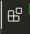
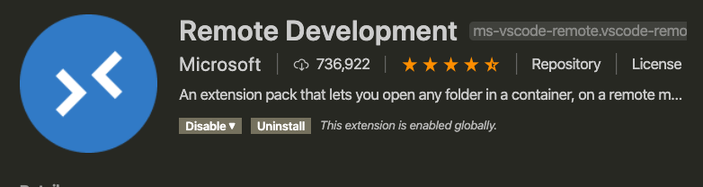

# School or work tips

## 1. Connect to remote SSH with Visual studio code
- Download Visual Studio Code 
https://code.visualstudio.com/
- After download, open Visual Studio Code
- Click extension on the left side bar 

- download Remote Development 
